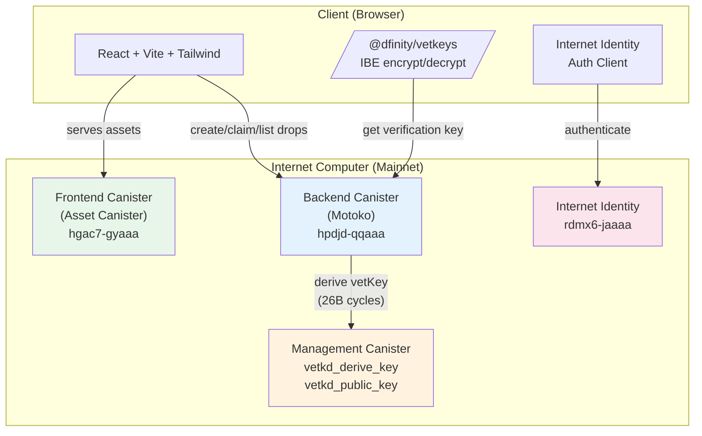
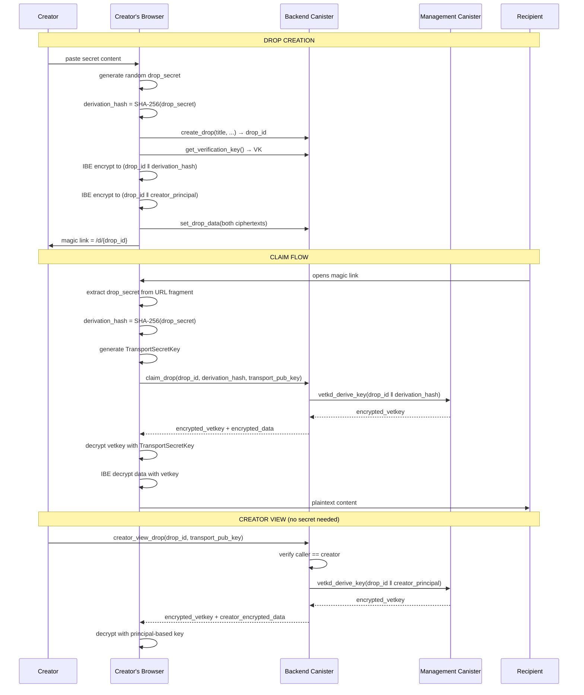

# VaultDrop

**Encrypted dead-drop sharing on ICP with vetKeys.**

Live at [vaultdrop.yorn.sh](https://vaultdrop.yorn.sh) | Built in a single session as part of the [ICP Skills Test](https://skills.internetcomputer.org) — Day 1.

> **Note:** This was built as an exercise to test the baseline developer experience of building on ICP using an AI agent (Claude Code, Opus 4.6) **without loading any ICP skills**. The agent relied entirely on its training data and web search. See [Findings](#findings) below.

---

## What it does

Share secrets with anyone via a magic link. No signup required for the recipient. Encrypted end-to-end using ICP vetKeys (threshold IBE).

```
You paste a secret → it's encrypted in your browser → you get a magic link →
recipient clicks the link → signs in with Internet Identity → decrypts in their browser
```

## Architecture



## Encryption Design

Two independent encryption paths — one for recipients (magic link), one for the creator (principal-based):



### Security properties

| Property | Guarantee |
|---|---|
| Wrong magic link secret | Different derivation input → different vetKey → decryption fails |
| Non-creator viewing | `creator_view_drop` checks `caller == creator` and uses a separate derivation path |
| Max claims | Canister enforces rate limit before deriving keys |
| Expiry | Time-checked before key derivation |
| Data at rest | Ciphertext only — canister stores IBE-encrypted blobs |
| Canister operator | Cannot read data (encrypted before upload) |
| Subnet collusion (< threshold) | Protected by threshold key derivation |
| Subnet collusion (≥ threshold) | **Not protected** — this is the ICP trust assumption |

## Test Suite

22 PICjs tests covering all security assumptions:

```
npm run test    # from tests/

✓ Drop creation (3 tests)
✓ Drop info — metadata doesn't leak ciphertext (3 tests)
✓ Drop listing isolation — Alice can't see Bob's drops (1 test)
✓ Max claims enforcement (1 test)
✓ Expiry enforcement (1 test)
✓ Cryptographic access control — wrong secret → wrong key (2 tests)
✓ Data privacy — blobs returned unmodified (1 test)
✓ Nonexistent drops (1 test)
✓ Verification key stability (2 tests)
✓ Creator view — principal-based, no secret needed (4 tests)
✓ Claim log — records principal + timestamp (3 tests)
```

## Stack

| Layer | Tech |
|---|---|
| Backend | Motoko, raw `vetkd_derive_key` / `vetkd_public_key` management canister calls |
| Frontend | React, Vite, Tailwind CSS, TanStack Query |
| Crypto | `@dfinity/vetkeys` (IBE encryption, transport keys) |
| Auth | Internet Identity via `@dfinity/auth-client` |
| Testing | PICjs (`@dfinity/pic`) + Vitest |
| Deployment | dfx 0.30.1, custom domain via `icp0.io` API |

---

## Findings

This project was built in ~2 hours using Claude Code (Opus 4.6) **without loading any ICP developer skills**. Here's what we learned about the baseline AI-assisted developer experience:

### What worked well

- **vetKeys API**: The agent found correct, current documentation and implemented the crypto correctly on the first try. The `@dfinity/vetkeys` npm package has a clean API.
- **PICjs testing**: Once configured, the test infrastructure was excellent. 22 tests running in ~6 seconds with full vetKD support.
- **Mainnet deployment**: Smooth from the developer's perspective. `dfx deploy --network ic` just worked.
- **Custom domain setup**: Straightforward once the agent searched for current docs. Three DNS records + one curl.

### What didn't work well

- **Local Internet Identity setup was a 🔴 blocker (20 minutes)**. This was the single biggest friction point. The compounding issues:
  1. `type: "pull"` pulls the production WASM which fails local response verification
  2. `internet_identity_dev.wasm.gz` is backend-only — no frontend assets — but nothing clearly states this
  3. II silently split into two canisters (backend + frontend) — the frontend canister is new
  4. `dfx deps pull` fails for `internet_identity_frontend` (missing `.sha256` in the GitHub release)
  5. The frontend canister has a different init type (`InternetIdentityFrontendInit`) that had to be extracted from WASM metadata with `ic-wasm`

  **Recommendation**: A single `dfx` command or `dfx.json` snippet that "just works" for local II would eliminate the #1 onboarding friction point.

- **Motoko `transient`/`persistent` syntax**: The agent generated pre-EOP Motoko syntax. Minor — compiler errors are clear.

- **PocketIC vetKD configuration**: Not documented in PicJS docs. You need an II or Fiduciary subnet configured to provision test keys, but the TypeScript types don't hint at this.

- **Wallet vs. cycles ledger on mainnet**: `dfx canister create` defaults to the wallet canister even when cycles are on the ledger. The wallet was out of cycles; the ledger had 20 TC. Required `--no-wallet` flag.

### The bottom line

An experienced developer with an AI agent can go from zero to a deployed, tested, vetKeys-powered app on mainnet in ~2 hours — **if** they can get past the II local dev setup. A junior developer would likely be stuck for much longer on that step.

The ICP developer experience is strong once you're past the initial configuration hurdles. The primitives (vetKeys, asset canisters, PocketIC, custom domains) are well-designed. The gaps are in the "first 30 minutes" tooling and documentation.

---

## Running locally

```bash
# Install dependencies
mops install
cd frontend && npm install && cd ..
cd tests && npm install && cd ..

# Start local replica
dfx start --clean --background

# Deploy II (see dfx.json for the custom canister config)
dfx deploy internet_identity
dfx deploy internet_identity_frontend

# Deploy the app
dfx deploy backend --argument '("dfx_test_key")'
cd frontend && npx vite build && cd ..
dfx deploy frontend

# Run tests
cd tests && npx vitest run

# Start dev server
cd frontend && npm run dev
```
